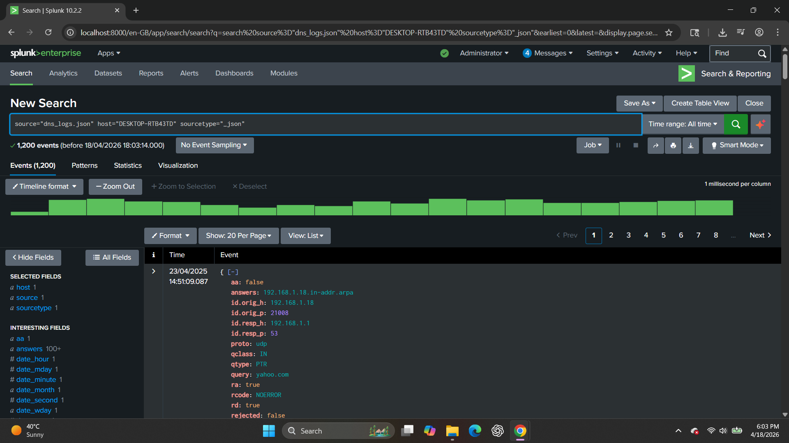
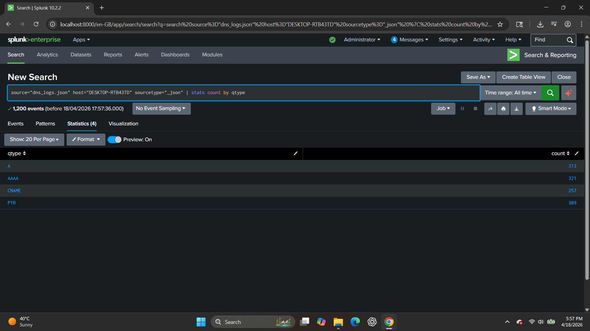
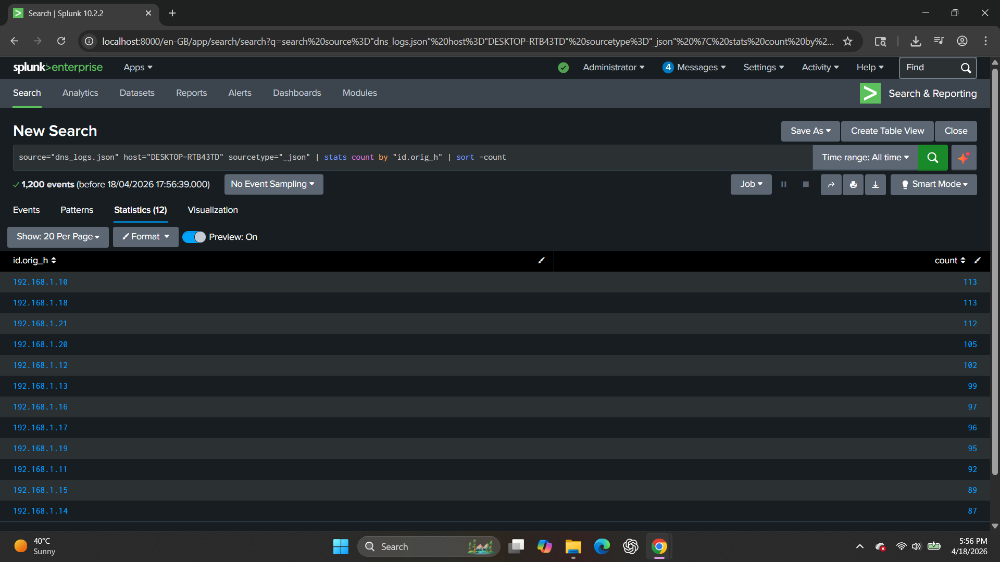
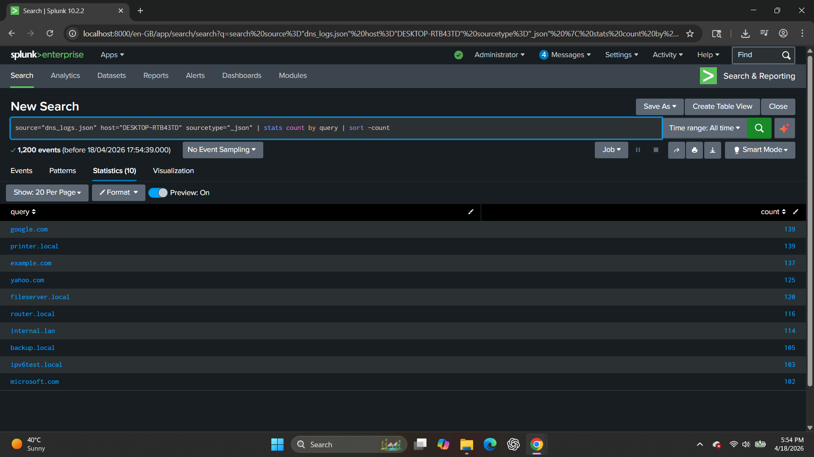

🌐 DNS Log Analysis using Splunk

This project demonstrates hands-on analysis of DNS logs using Splunk to identify query patterns, detect anomalies, and investigate potential suspicious activity.

The logs were ingested in JSON format and analyzed using Splunk’s Search Processing Language (SPL), simulating real-world SOC (Security Operations Center) investigations.

---

🛠️ Log Source Details

| Field      | Value           |
| ---------- | --------------- |
| Source     | dns_logs.json   |
| Sourcetype | _json           |
| Host       | DESKTOP-RTB43TD |

---

🔍 Analysis & Findings

---

🔹 1. Basic DNS Log Exploration

📸 Screenshot


🔎 Query

```
source="dns_logs.json" host="DESKTOP-RTB43TD" sourcetype="_json"
```

📖 Explanation

This query retrieves all DNS log events to understand the dataset structure and key fields such as:

* Query domain (query)
* Query type (qtype)
* Source IP (id.orig_h)
* Destination IP (id.resp_h)
* Response code (rcode)

🎯 SOC Insight

Understanding log structure is the foundation of any investigation.

---

🔹 2. DNS Query Types Distribution

📸 Screenshot


🔎 Query

```
source="dns_logs.json" host="DESKTOP-RTB43TD" sourcetype="_json"
| stats count by qtype
```

📖 Explanation

Counts DNS requests by query type (A, AAAA, CNAME, PTR).

🚨 SOC Use Case

* Identify unusual DNS behavior
* Detect tunneling attempts
* Analyze query distribution

🧠 Finding

Common query types observed:

* A
* AAAA
* CNAME
* PTR

Indicates normal DNS resolution activity.

---

🔹 3. Top Source IPs Generating DNS Traffic

📸 Screenshot


🔎 Query

```
source="dns_logs.json" host="DESKTOP-RTB43TD" sourcetype="_json"
| stats count by id.orig_h
| sort -count
```

📖 Explanation

Identifies which IP addresses generate the most DNS requests.

🚨 SOC Use Case

* Detect compromised hosts
* Identify internal scanning activity
* Monitor abnormal traffic spikes

🧠 Finding

Multiple internal IPs generated high DNS traffic, indicating active internal network communication.

---

🔹 4. Most Queried Domains

📸 Screenshot


🔎 Query

```
source="dns_logs.json" host="DESKTOP-RTB43TD" sourcetype="_json"
| stats count by query
| sort -count
```

📖 Explanation

Shows the most frequently queried domains.

🚨 SOC Use Case

* Detect suspicious domains
* Identify beaconing behavior
* Monitor external communications

🧠 Finding

Top domains include:

* google.com
* yahoo.com
* microsoft.com
* internal.local domains

Indicates a mix of normal internet and internal DNS activity.

---

🔹 5. DNS Response Analysis

📸 Screenshot


🔎 Query

```
source="dns_logs.json" host="DESKTOP-RTB43TD" sourcetype="_json"
| stats count by rcode
```

📖 Explanation

Analyzes DNS response codes.

🚨 SOC Use Case

* Detect failed resolutions
* Identify suspicious domains
* Monitor DNS errors

🧠 Finding

Most responses were:

* NOERROR → Successful queries

Indicates stable DNS resolution behavior.

---

🔗 MITRE ATT&CK Mapping

This analysis aligns with:

* T1046 – Network Service Scanning
* T1071.004 – Application Layer Protocol (DNS)
* T1568 – Dynamic Resolution

---

✅ Conclusion

This DNS log analysis demonstrates how Splunk can be used to:

* Analyze DNS traffic patterns
* Detect suspicious queries
* Identify high-activity hosts
* Investigate potential threats

This project reflects real SOC workflows including log analysis, threat detection, and anomaly investigation.
