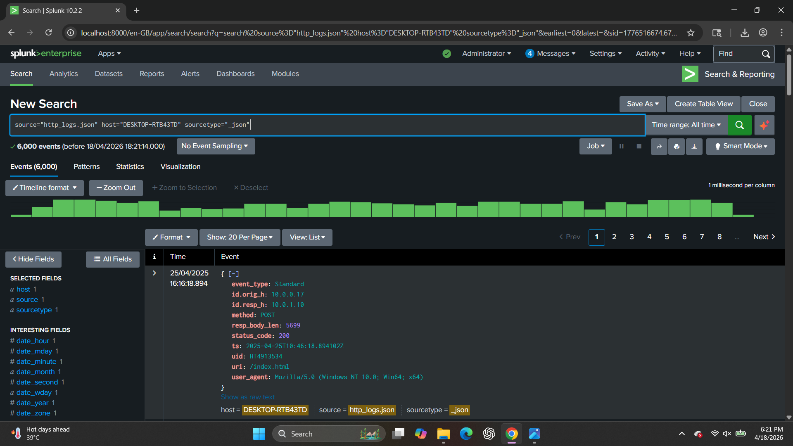
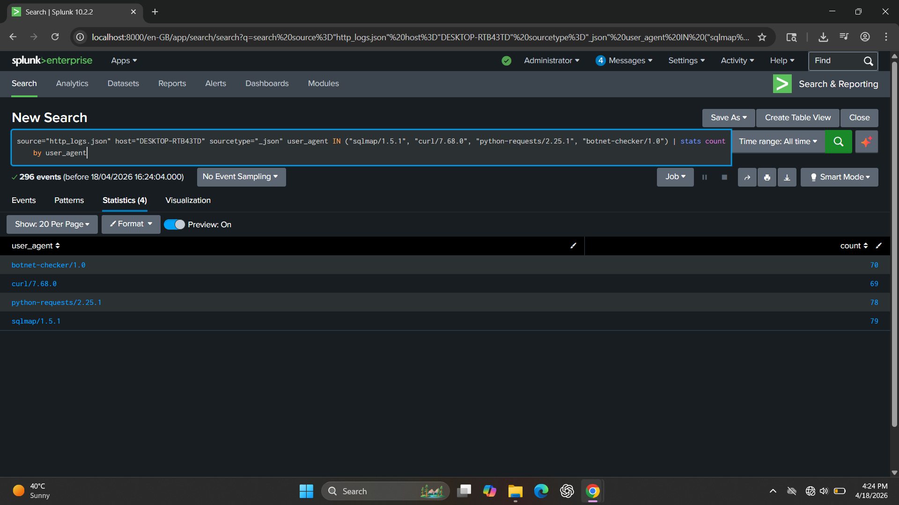
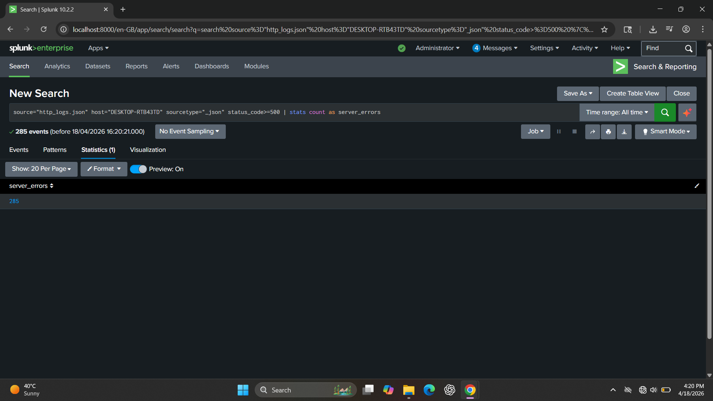
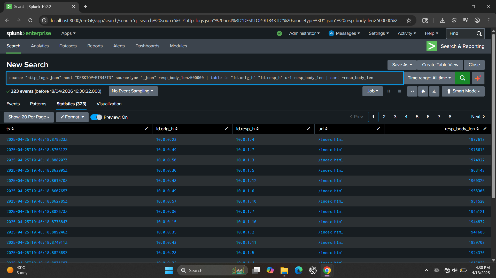

# 🌐 HTTP Log Analysis using Splunk

## 📌 Overview

This project demonstrates hands-on HTTP log analysis using Splunk to identify suspicious activities, abnormal traffic patterns, and potential security threats.

The logs were ingested in JSON format and analyzed using Splunk’s Search Processing Language (SPL). This simulates real-world SOC (Security Operations Center) investigation workflows.

---

## 🛠️ Log Source Details

| Field      | Value           |
| ---------- | --------------- |
| Source     | http_logs.json  |
| Sourcetype | _json           |
| Host       | DESKTOP-RTB43TD |

---

## 🔍 Analysis & Findings

---

### 🔹 1. Basic Log Exploration

#### 📸 Screenshot

screenshots/ basic_log_search.png

#### 🔎 Query

```spl id="8w7l9k"
source="http_logs.json" host="DESKTOP-RTB43TD" sourcetype="_json"
```

#### 📖 Explanation

This query retrieves all HTTP log events and helps understand available fields like source IP, destination IP, URI, status code, and user-agent.

#### 🎯 SOC Insight

Helps analysts understand log structure before creating detections.

---

### 🔹 2. Detecting Large HTTP Responses

#### 📸 Screenshot



#### 🔎 Query

```spl id="6jfrx1"
source="http_logs.json" host="DESKTOP-RTB43TD" sourcetype="_json"
resp_body_len > 500000
| table ts id.orig_h id.resp_h uri resp_body_len
| sort -resp_body_len
```

#### 📖 Explanation

Filters unusually large HTTP responses which may indicate abnormal data transfer.

#### 🚨 SOC Use Case

* Data exfiltration
* Large suspicious downloads
* Abnormal traffic

---

### 🔹 3. Detecting Suspicious User Agents

#### 📸 Screenshot



#### 🔎 Query

```spl id="g4qz7t"
source="http_logs.json" host="DESKTOP-RTB43TD" sourcetype="_json"
user_agent IN ("sqlmap/1.5.1", "curl/7.68.0", "python-requests/2.25.1", "botnet-checker/1.0")
| stats count by user_agent
```

#### 📖 Explanation

Detects automated tools and suspicious scripts interacting with the server.

#### 🚨 SOC Use Case

* SQL injection testing
* Automated scanning
* Bot activity

---

### 🔹 4. Detecting Server Errors (5xx)

#### 📸 Screenshot



#### 🔎 Query

```spl id="4a3qph"
source="http_logs.json" host="DESKTOP-RTB43TD" sourcetype="_json"
status_code >= 500
| stats count as server_errors
```

#### 📖 Explanation

Identifies server-side errors which may indicate failures or attacks.

---

### 🔹 5. Top Source IP Analysis

#### 📸 Screenshot



#### 🔎 Query

```spl id="t0c3bj"
source="http_logs.json" host="DESKTOP-RTB43TD" sourcetype="_json"
| stats count by id.orig_h
| sort -count
| head 10
```

#### 📖 Explanation

Shows the most active IP addresses generating traffic.

#### 🚨 SOC Use Case

* Identify attackers
* Detect abnormal traffic spikes

---

## 🧬 MITRE ATT&CK Mapping

Aligned with MITRE ATT&CK:

* T1190 – Exploit Public-Facing Application
* T1071 – Application Layer Protocol
* T1046 – Network Service Scanning

---

## ✅ Conclusion

This analysis demonstrates practical SOC skills such as log investigation, anomaly detection, and identifying suspicious behavior using Splunk.

---

