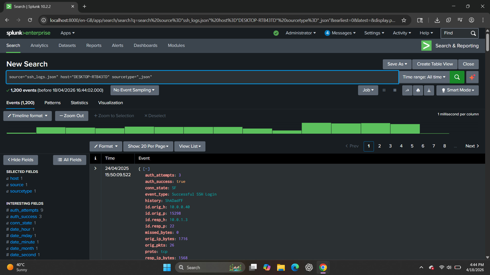
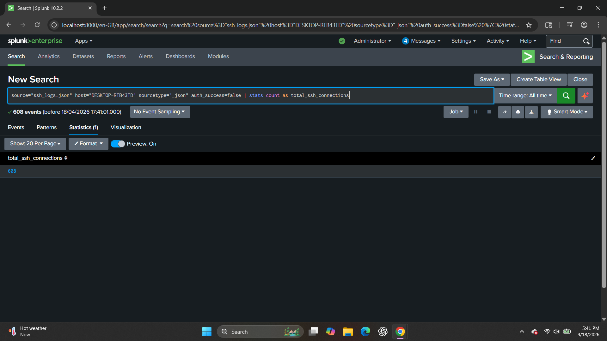
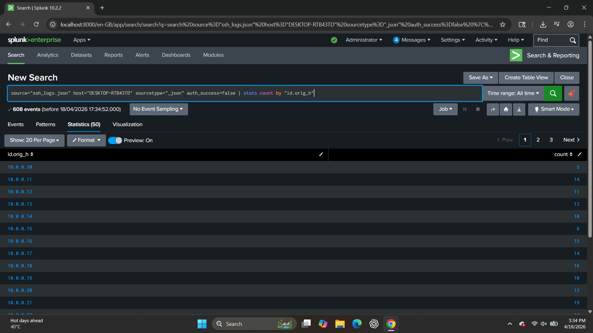
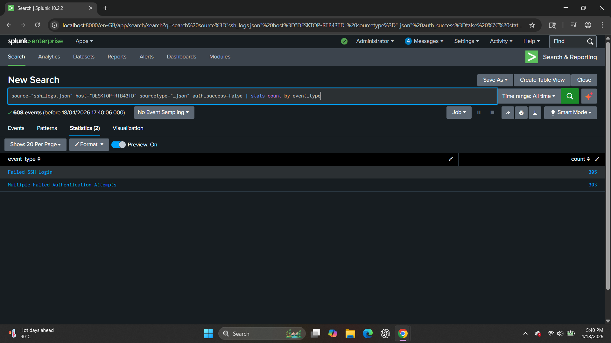
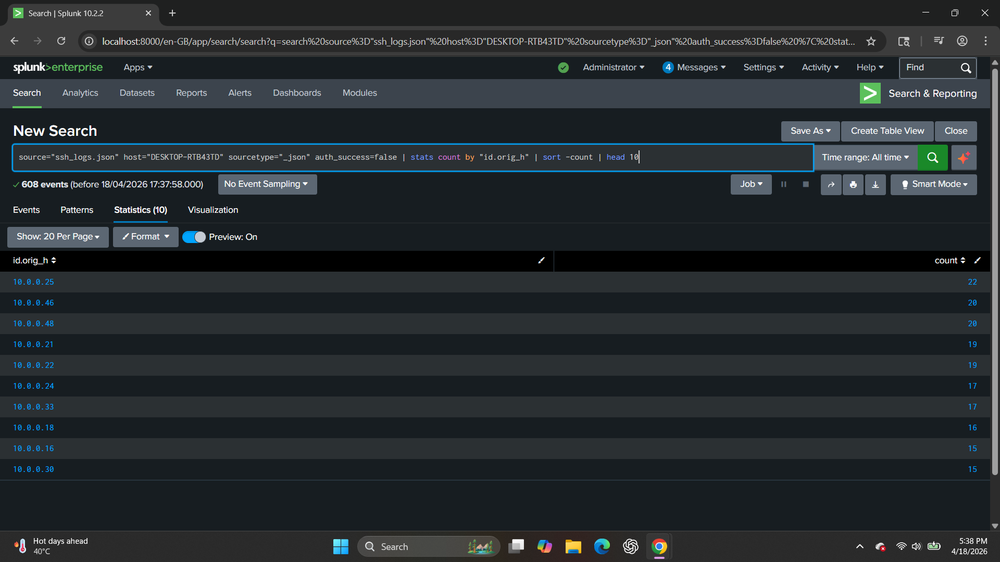

# 🔐 SSH Log Analysis using Splunk

This project demonstrates hands-on analysis of SSH logs using Splunk to detect suspicious login activity, brute-force attempts, and abnormal connection patterns.

The logs were ingested in JSON format and analyzed using Splunk’s Search Processing Language (SPL), simulating real-world SOC investigations.

---

## 🛠️ Log Source Details

| Field      | Value           |
| ---------- | --------------- |
| Source     | ssh_logs.json   |
| Sourcetype | _json           |
| Host       | DESKTOP-RTB43TD |

---

## 🔍 Analysis & Findings

---

### 🔹 1. Basic Log Exploration

#### 📸 Screenshot



#### 🔎 Query

```spl
source="ssh_logs.json" host="DESKTOP-RTB43TD" sourcetype="_json"
```

#### 📖 Explanation

This query retrieves all SSH log events to understand the dataset structure and key fields such as:

* Source IP (`id.orig_h`)
* Destination IP (`id.resp_h`)
* Authentication status (`auth_success`)
* Event type
* Connection details

#### 🎯 SOC Insight

Understanding the log structure is the first step in any investigation.

---

### 🔹 2. Failed SSH Login Attempts

#### 📸 Screenshot



#### 🔎 Query

```spl
source="ssh_logs.json" host="DESKTOP-RTB43TD" sourcetype="_json"
auth_success=false
| stats count as total_failed_attempts
```

#### 📖 Explanation

Filters logs where authentication failed and counts total failed login attempts.

#### 🚨 SOC Use Case

* Detect brute-force attacks
* Identify repeated login failures
* Monitor unauthorized access attempts

#### 🧠 Finding

A total of **608 failed login attempts** were observed.

---

### 🔹 3. Failed Login Attempts by Source IP

#### 📸 Screenshot



#### 🔎 Query

```spl
source="ssh_logs.json" host="DESKTOP-RTB43TD" sourcetype="_json"
auth_success=false
| stats count by id.orig_h
| sort -count
```

#### 📖 Explanation

Groups failed login attempts by source IP.

#### 🚨 SOC Use Case

* Identify attacking IPs
* Detect brute-force sources
* Prioritize blocking

#### 🧠 Finding

Multiple IPs generated high failed login attempts.

---

### 🔹 4. Event Type Analysis

#### 📸 Screenshot



#### 🔎 Query

```spl
source="ssh_logs.json" host="DESKTOP-RTB43TD" sourcetype="_json"
auth_success=false
| stats count by event_type
```

#### 📖 Explanation

Categorizes failed login events by type.

#### 🚨 SOC Use Case

* Understand attack behavior
* Differentiate attack patterns

#### 🧠 Finding

* Failed SSH Login
* Multiple Failed Authentication Attempts

---

### 🔹 5. Top Attacking IPs

#### 📸 Screenshot



#### 🔎 Query

```spl
source="ssh_logs.json" host="DESKTOP-RTB43TD" sourcetype="_json"
auth_success=false
| stats count by id.orig_h
| sort -count
| head 10
```

#### 📖 Explanation

Identifies top 10 attacking IPs.

#### 🚨 SOC Use Case

* Detect attackers
* Support incident response
* Feed firewall rules

#### 🧠 Finding

Certain IPs showed significantly higher activity.

---

## 🔗 MITRE ATT&CK Mapping

* T1110 – Brute Force
* T1078 – Valid Accounts
* T1046 – Network Service Scanning

---

## ✅ Conclusion

This SSH log analysis demonstrates how Splunk helps:

* Detect brute-force attacks
* Identify malicious IPs
* Analyze authentication patterns
* Perform SOC investigations
