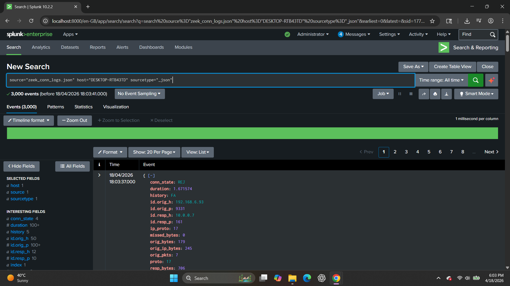
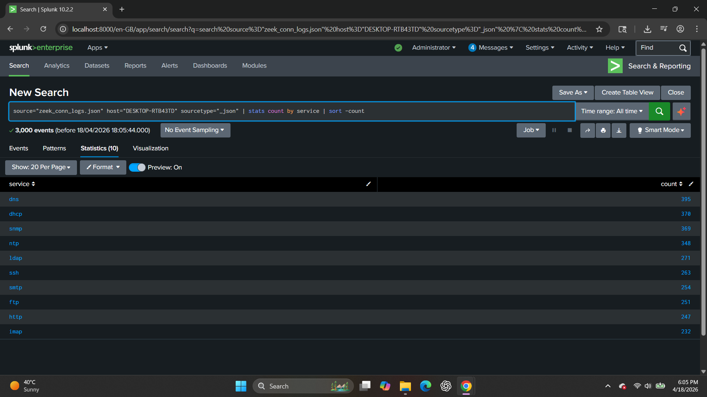
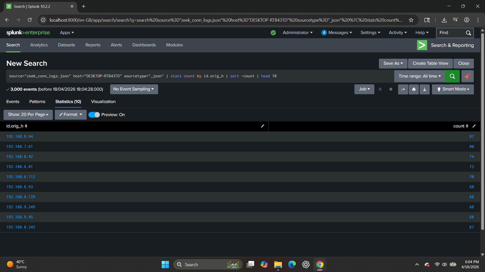
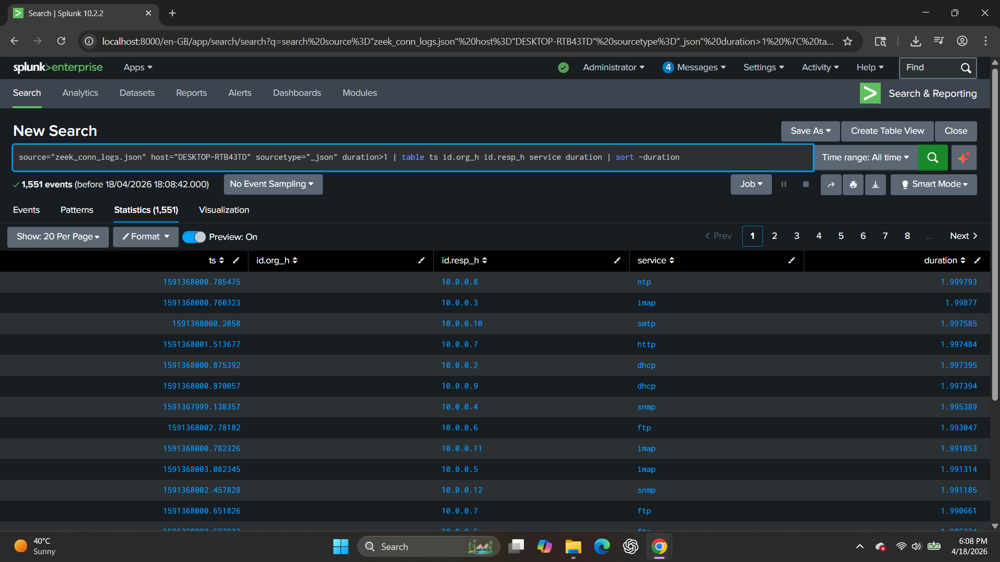

# 🌐 Zeek Connection Log Analysis using Splunk

This project demonstrates hands-on analysis of Zeek connection logs using Splunk to identify network behavior, service usage, top communicating hosts, and abnormal traffic patterns.

The logs were ingested in JSON format and analyzed using Splunk’s Search Processing Language (SPL), simulating real-world SOC (Security Operations Center) investigations.

---

## 🛠️ Log Source Details

| Field        | Value                  |
|-------------|------------------------|
| Source      | zeek_conn_logs.json    |
| Sourcetype  | _json                  |
| Host        | DESKTOP-RTB43TD        |

---

## 🔍 Analysis & Findings

---

### 🔹 1. Basic Log Exploration

📸 Screenshot  

🔎 **Query**

source="zeek_conn_logs.json" host="DESKTOP-RTB43TD" sourcetype="_json"

📖 **Explanation**

This query retrieves all connection log events to understand the dataset structure and key fields such as:

- Source IP (`id.orig_h`)
- Destination IP (`id.resp_h`)
- Service (`service`)
- Duration (`duration`)
- Connection state (`conn_state`)

🎯 **SOC Insight**

Understanding the log structure is the first step in any investigation and helps in identifying relevant fields for threat detection.

---

### 🔹 2. Services Distribution

📸 Screenshot  

🔎 **Query**

source="zeek_conn_logs.json" host="DESKTOP-RTB43TD" sourcetype="_json"
| stats count by service
| sort -count

📖 **Explanation**

This query counts the number of connections per service and sorts them in descending order.

🚨 **SOC Use Case**

- Identify most frequently used services  
- Detect unusual or unauthorized services  
- Monitor service-level traffic behavior  

🧠 **Finding**

Multiple services such as DNS, DHCP, SNMP, NTP, and HTTP were observed, indicating normal network operations with potential areas for anomaly detection.

---

### 🔹 3. Top Source IPs

📸 Screenshot  

🔎 **Query**

source="zeek_conn_logs.json" host="DESKTOP-RTB43TD" sourcetype="_json"
| stats count by id.orig_h
| sort -count
| head 10

📖 **Explanation**

Groups logs by source IP and identifies the top 10 hosts generating the most traffic.

🚨 **SOC Use Case**

- Detect high-traffic endpoints  
- Identify compromised or infected systems  
- Prioritize investigation of suspicious hosts  

🧠 **Finding**

Some internal IPs generated significantly higher traffic volumes, which may require further investigation.

---

### 🔹 4. Top Destination IPs

📸 Screenshot  

🔎 **Query**

source="zeek_conn_logs.json" host="DESKTOP-RTB43TD" sourcetype="_json"
| stats count by id.resp_h
| sort -count
| head 10

📖 **Explanation**

Identifies the most frequently contacted destination IPs.

🚨 **SOC Use Case**

- Detect critical servers  
- Identify suspicious outbound connections  
- Monitor lateral movement within the network  

🧠 **Finding**

Top destination IPs belong mostly to internal network ranges (10.0.0.x), indicating internal communication patterns.

---

### 🔹 5. Long Duration Connections

📸 Screenshot  

🔎 **Query**

source="zeek_conn_logs.json" host="DESKTOP-RTB43TD" sourcetype="_json"
duration>1
| table ts id.orig_h id.resp_h service duration
| sort -duration

📖 **Explanation**

Filters connections with longer durations and displays relevant fields.

🚨 **SOC Use Case**

- Detect persistent connections  
- Identify potential data exfiltration  
- Spot command-and-control (C2) communication  

🧠 **Finding**

Several long-duration connections were observed, indicating persistent sessions that may require deeper analysis.

---

## 🔗 MITRE ATT&CK Mapping

- T1046 – Network Service Discovery  
- T1071 – Application Layer Protocol  
- T1021 – Remote Services  

---

## ✅ Conclusion

This Zeek connection log analysis demonstrates how Splunk can be used to:

- Analyze network traffic patterns  
- Identify top communicating hosts  
- Detect abnormal service usage  
- Investigate long-duration connections  

The project reflects practical SOC analyst workflows including log analysis, traffic profiling, and anomaly detection.
